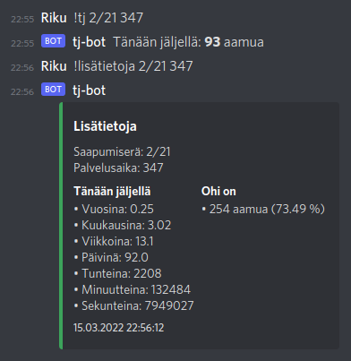

# Tj-bot

A Discord bot written in Python to remind your friend serving in the Finnish military how many mornings they have left and wish them good mornings. The bot speaks Finnish.

Discord-botti, joka kertoo päivän tj-luvun ja toivottaa aamuja intissä olevalle kaverillesi.

## Esimerkki



## Komennot

Bottia käytetään antamalla sille komentoja chatin kautta. Huomaa, että botin käyttämät komennot alkavat huutomerkillä "!".

| Komento      | Selitys                     |
| ------------ | --------------------------- |
| !aamuja      | Toivottaa aamuja            |
| !help        | Listaa komennot             |
| !lisätietoja | Yksityiskohtaisempaa tietoa |
| !tj          | Tänään jäljellä             |
| !ohi         | Aamuja ohi                  |

### Parametrit

Komennot `!tj`, `!ohi` ja `!lisätietoja` tukevat vaihtoehtoisten saapumiserien ja palvelusaikojen syöttämistä parametreina. Jos parametrejä ei anneta, komento palauttaa oletuksena uusimman saapumiserän tiedot 347 vuorokauden palvelusajalla. Esimerkiksi komento `!tj 2/21 165` kertoo saapumiserän 2/21 165 vuorokautta palvelevien tj-luvun.

Tuetut saapumiserät:
- 1/21
- 2/21
- 1/22

Tuetut palvelusajat:
- 165
- 255
- 347

## Asennusohjeet

!! Huomaathan, että discord.py kehitys on päättynyt, joten botti saattaa jossain kohtaa lakata toimimasta

Aloita luomalla sovellus ja siihen botti [Discordin sivuilla](https://discord.com/developers/applications). Generoi token ja ota se talteen myöhempää käyttöä varten. Valitse botille myös tarvittavat käyttöoikeudet. Ylläpitäjän (administrator) oikeuksia ei tarvita, sillä tj-bot vain lukee viestejä ja reagoi komentoihin. Lisää myös tämän sivun kautta botti omalle Discord-palvelimellesi. Oletetaan, että Git ja Python ovat asennettuina Linuxille.

```bash
# Kloonaa repositorio
$ git clone https://github.com/rikurauhala/tj-bot

# Siirry kansioon
$ cd tj-bot

# Luo virtuaaliympäristö ja aktivoi se
# Järjestelmästä riippuen voit joutua käyttämään komentoa python3 tai asentamaan
# ensin virtuaaliympäristön pip-työkalun avulla
$ python -m venv venv
$ source venv/bin/activate

# Asenna riippuvuudet
$ pip install -r requirements.txt

# Luo .env-tiedosto ja lisää bottisi salainen token
# Korvaa {token} bottisi tokenilla, jonka saat Discordin Developer portal -sivulta
$ echo "DISCORD_TOKEN={token}" > .env

# Siirry lähdekoodin sisältävään kansioon ja käynnistä botti
$ cd application
$ python bot.py
```
